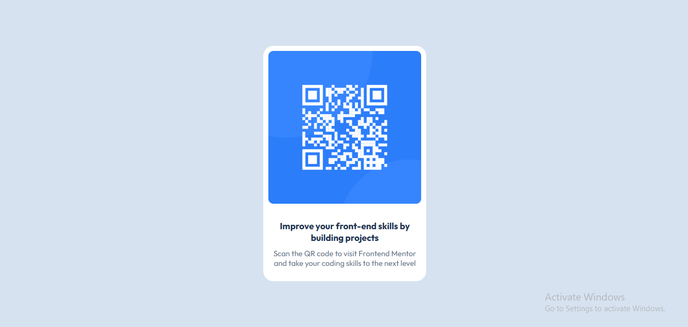

# Frontend Mentor - QR code component solution

This is a solution to the [QR code component challenge on Frontend Mentor](https://www.frontendmentor.io/challenges/qr-code-component-iux_sIO_H). Frontend Mentor challenges help you improve your coding skills by building realistic projects.

## Table of contents

- [Overview](#overview)
  - [Screenshot](#screenshot)
  - [Links](#links)
- [My process](#my-process)
  - [Built with](#built-with)
  - [What I learned](#what-i-learned)
  - [Continued development](#continued-development)
  - [Useful resources](#useful-resources)
- [Author](#author)
- [Acknowledgments](#acknowledgments)

**Note: Delete this note and update the table of contents based on what sections you keep.**

## Overview

### Screenshot



### Links

- Github: [Adektivity](https://github.com/adektivity/FrontEnd-QR)
- Live Site: [Live Site](https://adektivity.github.io/FrontEnd-QR/)

## My process

### Built with

- Semantic HTML5 markup
- CSS 3
- Flexbox
- CSS Grid
- Mobile-first workflow

### What I learned

This project was a great way to learn about different methods of centering items on a web page using CSS. Ended up using Grid as it was the most straight-forward way of centering items on the webpage.

```css
body {
  display: grid;
  min-height: 100vh;
  place-items: center;
}
```

I also learned how to scale my website across different screen sizes.

### Continued development

I want to further learn CSS Flexbox and Grid and ways in which they can be used to build better interfaces.

### Useful resources

- [Mozilla Web Docs](https://developer.mozilla.org/en-US/docs/Web/CSS/) - This helped me with different methods of centering elements on a webpage and rendering images properly.
- [Stackoverflow](https://stackoverflow.com/questions/41468951/images-not-displaying-in-github-pages) - This helped me to understand and resolve an issue I had with github pages not displaying the image on my website.

## Author

- Website - [Adektivity](https://github.com/adektivity)
- Frontend Mentor - [@adektivity](https://www.frontendmentor.io/profile/adektivity)
- Twitter - [@AdeksonWeb](https://x.com/AdeksonWeb)

## Acknowledgments

Thanks to everyone who put great learning resources out there. Y'all are the BEST!
